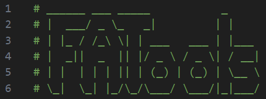
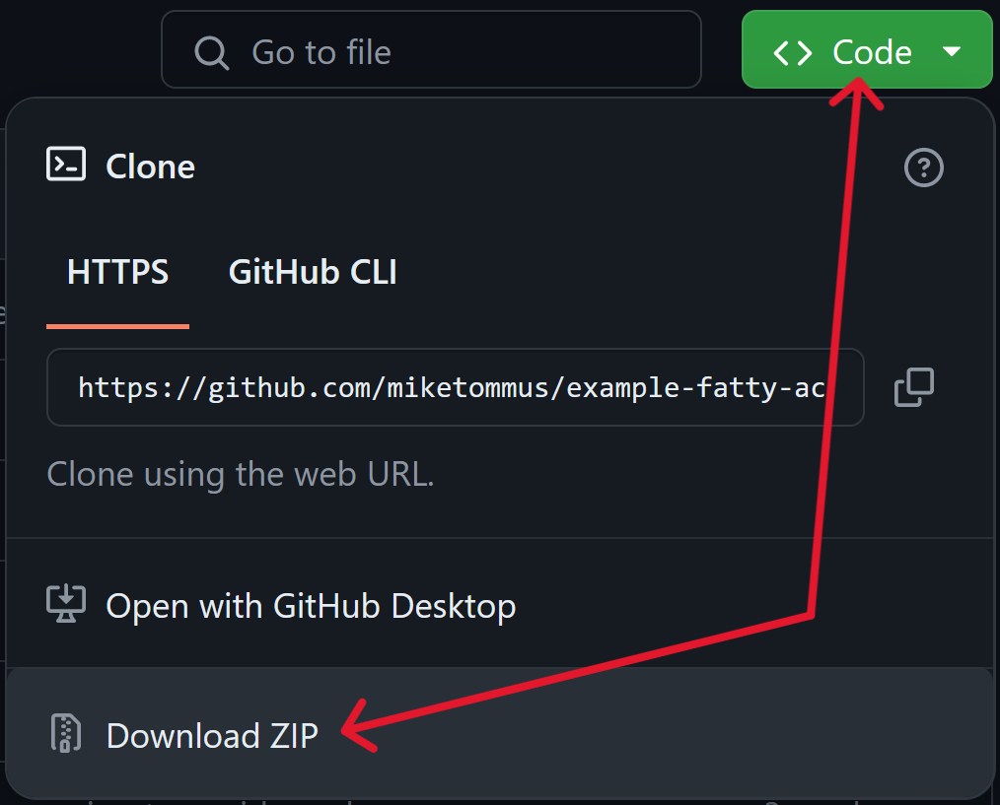
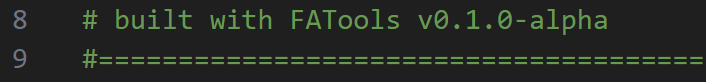

# **Example Fatty Acid Analysis Using R**

## What is this?

Example scripts that demonstrate how to use R (with emphasis on using the [FATools](https://www.github.com/miketommus/FATools) package) to post-process and analyze data resulting from gas chromatographic (GC) & mass spectrometric (MS) analysis of fatty acid methyl esters (FAME).

<p align="center">
  
  </p>

## But why tho? 

The primary purpose of maintaining this repository is to introduce new users to the [FATools](https://www.github.com/miketommus/FATools) R package. Since this package is under active development, these scripts may change frequently, but the goal is to always have an up-to-date example script to show the main uses of the package.

Visit the [README.md](https://github.com/miketommus/FATools/blob/master/README.md) for the FATools R package to learn about the current state of the package and how to install it onto your machine.



## How do I use this?

Copy this repo to your machine and run the scripts. This repo contains example data (found in the /data directory) so you can run the scripts even if you don't have your own data.

I suggest you step through the code with the example data first. Once you understand how the script works, then you can modify the code to work with your data.

### Core example data:

|**data/**|**description**|
|---|---|
|*example_gcms_results*|chromatogram compound peak areas|
|*example_sample_list*|general information about the example samples (IDs, tissue type, treatments)|
|*example_gravimetry*|results from gravimetric measurement of total lipid. Includes the mass of tissue extracted.|
|*example_compound_table*|contains information about external standards & compounds needed for quantitation|

## How do I copy the repo?

The easist way is to use Git from your terminal:

```bash
cd ~/where/you/want/the/repo

git clone https://github.com/miketommus/example-fatty-acid-analysis.git
```
Alternatively, you can click on the **"<> Code"** dropdown near the top of this page, followed by **"Download Zip"**. Unzip this file and you're ready to roll.

<p align="left">
  
</p>

## What if I want an older version of a script?

Good question. Generally, you'll want to download the latest version of the script, but there may be a case when you want to see an older version. The [FATools](https://www.github.com/miketommus/FATools) R package will be released using [semantic versioning](https://semver.org/). When sufficient changes to [FATools](https://www.github.com/miketommus/FATools) are made, I will also release a new version of this script following the same version numbering schema. 

These releases can be found under [Releases](https://github.com/miketommus/example-fatty-acid-analysis/releases) on GitHub. There, you'll be able to download old versions of the script. 

To see what version of [FATools](https://www.github.com/miketommus/FATools) any script was built off of, look in the header of the script for this:

