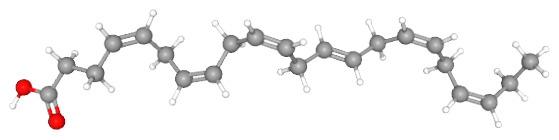

# **Example Fatty Acid Analysis Using R**


Example scripts that demonstrate how to use R (with emphasis on using the [FATools](https://www.github.com/miketommus/FATools) package) to post-process and analyze data resulting from gas chromatographic (GC) & mass spectrometric (MS) analysis of fatty acid methyl esters (FAME).

<p align="left">
  
  </p>

## **Overview**

The primary purpose of maintaining this repository is to introduce new users to the [FATools](https://www.github.com/miketommus/FATools) R package. Since FATools is under active development, these scripts may change frequently, but the goal is to always have an up-to-date example script to show the main uses of the package. 

The [FATools](https://www.github.com/miketommus/FATools) R package will be released using [semantic versioning](https://semver.org/). When sufficient changes to FATools are made, I will also release a new version of this repo following the same version numbering schema (e.g. if FATools is v0.5.0 this script will be released as v0.5.0). Releases can be found under [releases](https://github.com/miketommus/example-fatty-acid-analysis/releases). To see what version of [FATools](https://www.github.com/miketommus/FATools) any script was built off of, look in the header of the script for this:


Visit the [FATools README](https://github.com/miketommus/FATools/blob/master/README.md) to learn more about the current state of the package and how to install it onto your machine.

## **Getting Started**

### Prerequisites

These scripts utilize functions from the [FATools](https://www.github.com/miketommus/FATools) R package which is not on CRAN and must be intalled directly from GitHub. Installation instructions can be found in the [FATools README.](https://github.com/miketommus/FATools/blob/master/README.md)

This repository contains everthing needed to run; including example data (found in the /data directory). Copy this repo to your machine and run the scripts in R. I suggest stepping through the code with the example data first. Once you understand how the scripts work, then you can modify the code for your data.

### Installation

The easist way to copy this repo to your machine is to use Git from your terminal:

```bash
cd ~/where/you/want/the/repo

git clone https://github.com/miketommus/example-fatty-acid-analysis.git
```

### Alternative Installation
Alternatively, you can click on the "<> Code" dropdown near the top of this page, followed by "Download Zip". Unzip this file and you're ready to roll.

<br>
<p align="left">
  
</p>

## **How It Works**

The example data was generated by the extraction and analysis of lipids from 3 tissue types (algae, fish, & urchin) within 5 treatments (treatment_A - treatment_E). Lipids were extracted from tissues using standard methods and were derivatized to fatty acid methyl esters (FAME). FAME were subsequently analyzed using gas chromotography & mass spectrometry (GC/MS).

Core example data generated:

|**data/**|**description**|
|---|---|
|*example_gcms_results*|chromatogram compound peak areas|
|*example_sample_list*|general information about the example samples (IDs, tissue type, treatments)|
|*example_gravimetry*|results from gravimetric measurement of total lipid. Includes the mass of tissue extracted.|
|*example_compound_table*|contains information about external standards & compounds needed for quantitation|

### Concept of Operation

The script follows the following sequence:


<br>

**Set Variables & Data Import**

The example script begins by reading in the example data and setting a few variables related to the lipid extraction process that generated the example data ("extract_vol" & "prop_deriv"). "extract_vol" is the total volume (mL) of lipid extract and "prop_deriv" is the proportion (decimal %) of the lipid extract that was derivatized to FAME. In this example, 1.5 mL of lipid extract was produced and 1 mL of extract was used during derivatization; giving 1/1.5 or 66% of the total extract. 

**Data Wrangle**

After reading in the data, the script extracts relevant information needed for the analysis:

- Response factor mapping & information about GC/MS standards is sourced from the compound table
- Extracted tissue mass is sourced from the gravimetry data
- Just GCMS peak areas are sourced from the GCMS data. 

Finally, FA names are standardized throughout using convert_fa_name(); this is critical as other steps will need to match FA names to function properly.

**Post-Processing**

This is where the **FATools** package is used to convert GC/MS data (peak areas) into tissue concentrations and/or proportions. First, instrument response factors (RFs) are calculated from the GC/MS standards. RFs are used to calculate compound concentrations and a RF map is used to quantitate compounds not found in the GC/MS standards. Compound concentrations are adjusted by the amount of tissue extracted to generate tissue concentrations. Finally, tissue concentrations are converted to proportion (decimal % of all compounds). 

Here's a high-level view of what's happening during post-processing:


**Data Visualization & Export**

Finally, a few quick plots are made just to take a peek at the results and the final data is ready to be written to .csv or otherwise exported for further analysis. 
